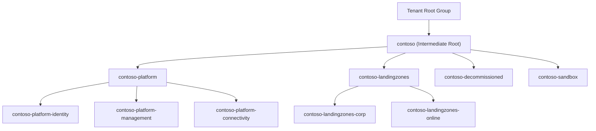

# Contoso — Enterprise-Scale Landing Zone Architecture

Contoso adopts the Microsoft **Cloud Adoption Framework (CAF) enterprise-scale**
management group hierarchy. Azure Policy is the primary control plane for
governance guardrails, applied at management group scopes so that all current
and future subscriptions inherit compliance.

## Management group hierarchy

| Management group | Purpose | Policy posture |
| --- | --- | --- |
| `contoso` | Intermediate root; org-wide guardrails | Governance + Security baselines (all pillars, mostly Audit) |
| `contoso-platform` | Shared platform services | Reliability + Security enforced (`Deny`) |
| `contoso-platform-identity` | Entra ID Domain Services, identity | Strict Security |
| `contoso-platform-management` | Log Analytics, automation, monitoring | Governance + diagnostics `DeployIfNotExists` |
| `contoso-platform-connectivity` | Hub network, firewall, DNS, gateways | Security (no public IPs), Reliability (ZR) |
| `contoso-landingzones` | Application landing zones | All five pillars |
| `contoso-landingzones-corp` | Internal, private-only workloads | Security `Deny` public network access |
| `contoso-landingzones-online` | Internet-facing workloads | Security (WAF/TLS) + Performance |
| `contoso-sandbox` | Experimentation | Cost guardrails, relaxed Security (Audit) |
| `contoso-decommissioned` | Retired subscriptions | Deny all resource creation |

## Policy inheritance model

- **Broad, safe guardrails** (allowed locations, required tags, audit rules)
  assign at `contoso` so everything inherits them.
- **Strict enforcement** (`Deny`, `DeployIfNotExists`) assigns lower in the tree
  (`contoso-platform`, `contoso-landingzones`) where the impact is understood.
- **Sandbox** receives cost-control guardrails and audit-only security so teams
  can move fast without exposing the org to risk.
- **Decommissioned** denies all new deployments to prevent zombie spend.

## Enforcement lifecycle

1. **Onboard** a policy in `Audit`/`AuditIfNotExists` at `contoso`.
2. **Measure** compliance for 2–4 weeks via the compliance dashboard.
3. **Remediate** existing non-compliant resources.
4. **Promote** the assignment `effect` to `Deny` at the target scope.
5. **Exempt** any justified exceptions with a time-boxed policy exemption.
